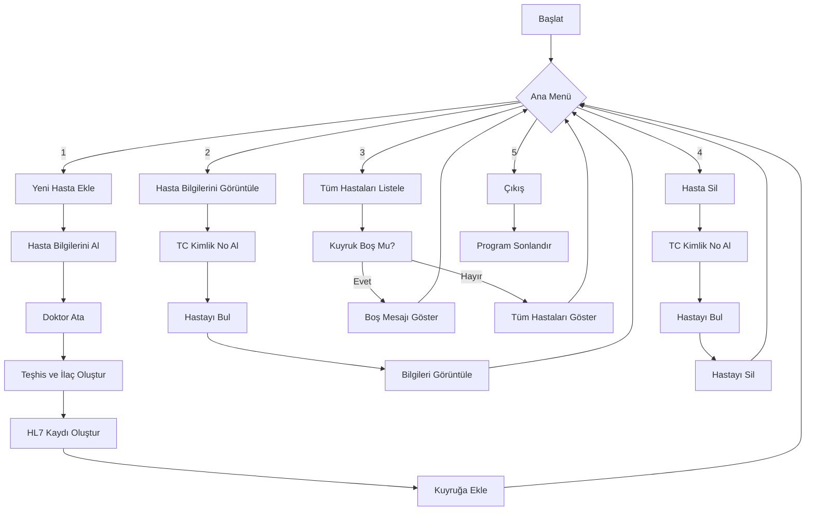

# Acil Servis Hasta Yönetim Sistemi - Proje Dökümanı

## 1. Proje Tanımı

Bu proje, hastane acil servislerinde hasta kayıt ve takip işlemlerini yönetmek için geliştirilmiş bir C programıdır. Sistem, hastaların kayıt edilmesi, triaj durumuna göre sınıflandırılması, şikayetlerine uygun doktora yönlendirilmesi ve hasta bilgilerinin HL7 standardında tutulması gibi temel işlevleri yerine getirmektedir.

## 2. Amaç ve Hedefler

### Amaç
- Acil servis hasta yönetim süreçlerini dijitalleştirmek
- Hastaların hızlı ve doğru şekilde uygun doktorlara yönlendirilmesini sağlamak
- Hasta verilerinin standart formatta saklanmasını sağlamak

### Hedefler
- Hasta kayıt sürecini optimize etmek
- Acil durum triaj sistemini uygulamak
- Doktor atama sürecini otomatikleştirmek
- Hasta verilerini HL7 formatında saklayarak diğer sistemlerle uyumluluğu sağlamak
- Kullanımı kolay bir arayüz sunmak

## 3. Sistem Mimarisi

### 3.1 Veri Yapıları

#### 3.1.1 Hasta (Patient) Yapısı
```c
typedef struct {
    char name[50];         // Hasta adı
    char surname[50];      // Hasta soyadı
    int age;               // Yaş
    char tc_no[12];        // TC kimlik numarası
    char triaj[10];        // Triaj durumu: kırmızı, sarı, yeşil
    char complaint[100];   // Hasta şikayeti
    char doctor[50];       // Yönlendirilen doktor
    char diagnosis[100];   // Teşhis
    char medication[100];  // İlaç
    char hl7_record[500];  // HL7 formatında hasta kaydı
    int prescription_no;   // Reçete numarası
} Patient;
```

#### 3.1.2 Kuyruk (Queue) Yapısı
```c
typedef struct {
    Patient patients[MAX_PATIENTS];  // Hasta dizisi
    int front, rear;                 // Kuyruk başı ve sonu
} Queue;
```

#### 3.1.3 Doktor (Doctor) Yapısı
```c
typedef struct {
    char name[50];         // Doktor adı
    char specialty[50];    // Uzmanlık alanı
} Doctor;
```

### 3.2 Modüler Yapı

Sistem aşağıdaki modüllere ayrılmıştır:

1. **Ana Modül**: Programın başlatılması ve kullanıcı arayüzü (main.c)
2. **Kuyruk Yönetim Modülü**: Hasta sırası yönetimi için kuyruk işlemleri
3. **Hasta İşlemleri Modülü**: Hasta kayıt, güncelleme ve silme
4. **Doktor Atama Modülü**: Hasta şikayetine göre uygun doktor atama
5. **HL7 Entegrasyon Modülü**: HL7 formatında veri oluşturma

## 4. Fonksiyonel Özellikler

### 4.1 Hasta Yönetimi

#### 4.1.1 Hasta Kaydı
- Hasta demografik bilgilerinin girilmesi
- Triaj durumunun belirlenmesi
- Hasta şikayetlerinin kaydedilmesi

#### 4.1.2 Hasta Bilgilerinin Görüntülenmesi
- TC kimlik numarasına göre hasta bilgisi sorgulama
- Tüm hasta listesini görüntüleme

#### 4.1.3 Hasta Kaydı Silme
- TC kimlik numarasına göre hasta silme

### 4.2 Triaj Sistemi

Acil servise gelen hastalar aciliyet durumlarına göre üç kategoride sınıflandırılır:

- **Kırmızı**: Acil müdahale gerektiren, hayati tehlikesi olan hastalar
- **Sarı**: Acil olmayan ancak öncelikli tedavi gerektiren hastalar
- **Yeşil**: Acil olmayan, bekleyebilecek durumdaki hastalar

### 4.3 Doktor Atama Sistemi

Hasta şikayetlerine göre otomatik olarak uygun uzmanlık alanındaki doktora yönlendirme:

| Şikayet İçeriği | Atanan Uzmanlık |
|-----------------|-----------------|
| kalp, göğüs | Kardiyoloji |
| baş ağrısı, sinir | Nöroloji |
| ameliyat, yaralanma | Genel Cerrahi |
| kemik, eklem | Ortopedi |
| öksürük, ateş, kusma | Dahiliye |
| Diğer şikayetler | Dahiliye (varsayılan) |

### 4.4 HL7 Entegrasyonu

Hasta bilgileri uluslararası sağlık veri standardı olan HL7 formatında saklanır:

```
MSH|^~\&|HOSPITAL|ER|LAB|202310101200||ADT^A01|123456|P|2.5
PID|||[Hasta Adı]^[Hasta Soyadı]||[Yaş]|||[TC Kimlik No]
PV1|||[Doktor]||||||||||||||||||||||||||||||||||||||||||||||||||||
DG1|||[Teşhis]
RXA|||[İlaç]
PRB|||[Reçete No]
```

## 5. Algoritma Açıklamaları

### 5.1 Kuyruk İşlemleri

#### 5.1.1 Dairesel Kuyruk Algoritması

Sistemde dairesel kuyruk (circular queue) yapısı kullanılmıştır:

1. **Boş Kuyruk Kontrolü**: front = rear = -1
2. **Dolu Kuyruk Kontrolü**: (rear + 1) % MAX_PATIENTS == front
3. **Ekleme (Enqueue)**: rear = (rear + 1) % MAX_PATIENTS
4. **Çıkarma (Dequeue)**: front = (front + 1) % MAX_PATIENTS

Bu yapı, bellek kullanımını optimize eder ve sabit boyutlu dizi içinde verimli çalışır.

### 5.2 Doktor Atama Algoritması

```
findDoctor(complaint):
    if complaint contains "kalp" or "göğüs":
        return kardiolog
    else if complaint contains "baş ağrısı" or "sinir":
        return nörolog
    else if complaint contains "ameliyat" or "yaralanma":
        return cerrah
    else if complaint contains "kemik" or "eklem":
        return ortopedi uzmanı
    else if complaint contains "öksürük" or "ateş" or "kusma":
        return dahiliye uzmanı
    else:
        return dahiliye uzmanı (varsayılan)
```

### 5.3 HL7 Kayıt Oluşturma

```
createHL7Record(patient):
    MSH = "MSH|^~\&|HOSPITAL|ER|LAB|202310101200||ADT^A01|123456|P|2.5"
    PID = "PID|||" + patient.name + "^" + patient.surname + "||" + patient.age + "|||" + patient.tc_no
    PV1 = "PV1|||" + patient.doctor + "||||||||||||||||||||||||||||||||||||||||||||||||||||"
    DG1 = "DG1|||" + patient.diagnosis
    RXA = "RXA|||" + patient.medication
    PRB = "PRB|||" + patient.prescription_no
    
    patient.hl7_record = MSH + "\n" + PID + "\n" + PV1 + "\n" + DG1 + "\n" + RXA + "\n" + PRB
```

## 6. Uygulama Akış Şeması



## 7. Kullanıcı Arayüzü

Komut satırı tabanlı kullanıcı arayüzü beş ana seçenek sunar:

```
Acil Servis Uygulaması
1. Yeni Hasta Ekle
2. Hasta Bilgileri Görüntüle (Belirli Bir Hasta)
3. Eklenen Tüm Hastaları Görüntüle
4. Hasta Sil
5. Çıkış
Seçiminiz:
```

### 7.1 Yeni Hasta Ekleme Arayüzü

```
Hasta Adı: [Giriş]
Hasta Soyadı: [Giriş]
Yaş: [Giriş]
TC Kimlik No: [Giriş]
Triaj Durumu (kırmızı/sarı/yeşil): [Giriş]
Hasta Şikayeti (öksürük, ateş, kusma, vs.): [Giriş]
```

## 8. Test ve Doğrulama

### 8.1 Test Senaryoları

1. **Normal Hasta Ekleme**
   - Beklenen Sonuç: Hasta başarıyla eklenir ve doğru doktora yönlendirilir

2. **Dolu Kuyrukta Hasta Ekleme**
   - Beklenen Sonuç: "Kuyruk dolu! Hasta eklenemiyor." mesajı gösterilir

3. **Geçersiz TC Kimlik Numarası**
   - Beklenen Sonuç: Geçersiz giriş uyarısı (İleriki sürümlerde eklenecek)

4. **Var Olmayan TC Kimlik Numarası ile Hasta Arama**
   - Beklenen Sonuç: "TC kimlik numarası ile eşleşen hasta bulunamadı." mesajı gösterilir

### 8.2 Birim Testleri

- Kuyruk işlemlerinin doğruluğu (enqueue, dequeue, isEmpty, isFull)
- Doktor atama algoritmasının doğruluğu
- HL7 kayıt oluşturma işleminin doğruluğu

## 9. Kısıtlamalar ve Sınırlamalar

- Sistem maksimum 100 hasta kaydı tutabilir
- Sistemde 5 doktor tanımlanmıştır
- TC kimlik numarası doğrulama algoritması henüz eklenmemiştir
- Veriler kalıcı olarak saklanmamaktadır (programı kapatınca kaybolur)
- Kuyruk sıralama, triaj sınıfına göre değil, geliş sırasına göredir

## 10. Gelecek Geliştirmeler

### 10.1 Kısa Vadeli Geliştirmeler

- TC kimlik numarası doğrulama algoritması
- Hasta verilerinin dosyada saklanması
- Triaj durumuna göre hasta önceliklendirme

### 10.2 Uzun Vadeli Geliştirmeler

- Grafiksel kullanıcı arayüzü (GUI)
- Veritabanı entegrasyonu
- Hasta bilgilerini güncelleme özelliği
- Hasta geçmişi ve takibi
- Doktor çalışma çizelgesi
- Randevu sistemi entegrasyonu
- İstatistik ve raporlama modülü

## 11. Kurulum ve Konfigürasyon

### 11.1 Gereksinimler

- C Derleyicisi (GCC 5.0+ önerilir)
- Standard C Kütüphaneleri (stdio.h, stdlib.h, string.h, time.h)
- En az 64MB RAM
- 10MB boş disk alanı

### 11.2 Derleme Adımları

Linux/macOS:
```bash
gcc -Wall -Wextra -o acil_servis main.c
```

Windows:
```bash
gcc -Wall -Wextra -o acil_servis.exe main.c
```

## 12. Kaynaklar ve Referanslar

- HL7 Standardı: [https://www.hl7.org/](https://www.hl7.org/)
- Acil Servis Triaj Sistemleri: [https://www.acilafet.gov.tr/](https://www.acilafet.gov.tr/)
- C Programlama Dili ve Veri Yapıları: "The C Programming Language", Brian W. Kernighan & Dennis M. Ritchie

## 13. Ekler

### 13.1 Örnek HL7 Çıktısı

```
MSH|^~\&|HOSPITAL|ER|LAB|202310101200||ADT^A01|123456|P|2.5
PID|||Ahmet^Yılmaz||45|||12345678910
PV1|||Dr. Ahmet Yılmaz||||||||||||||||||||||||||||||||||||||||||||
